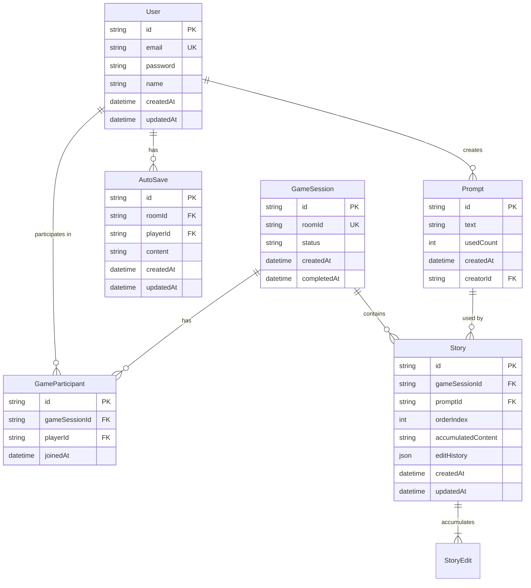
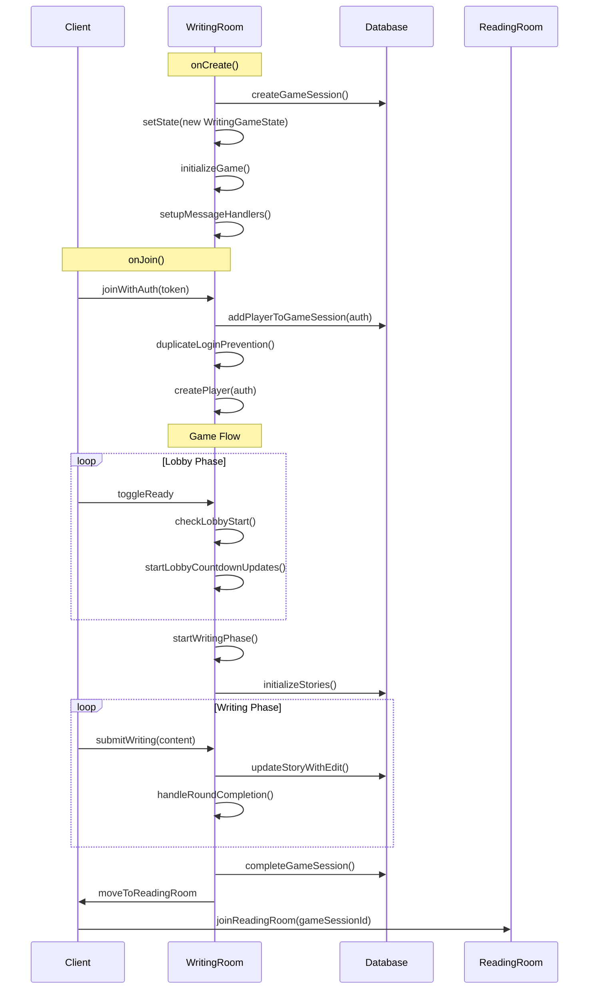
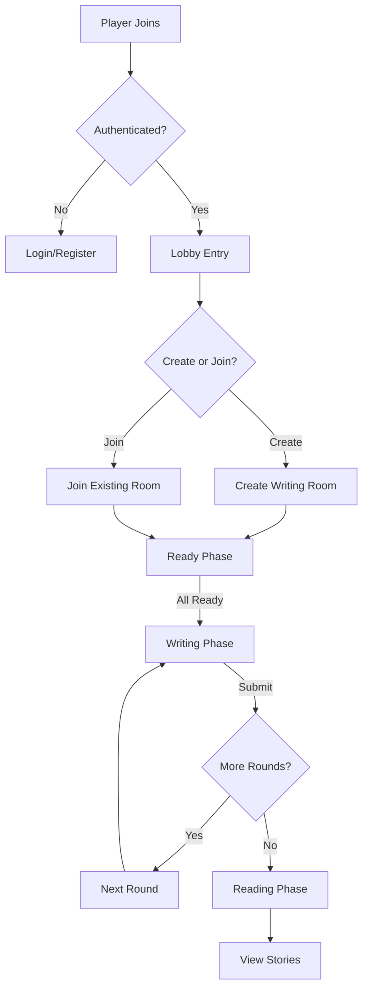
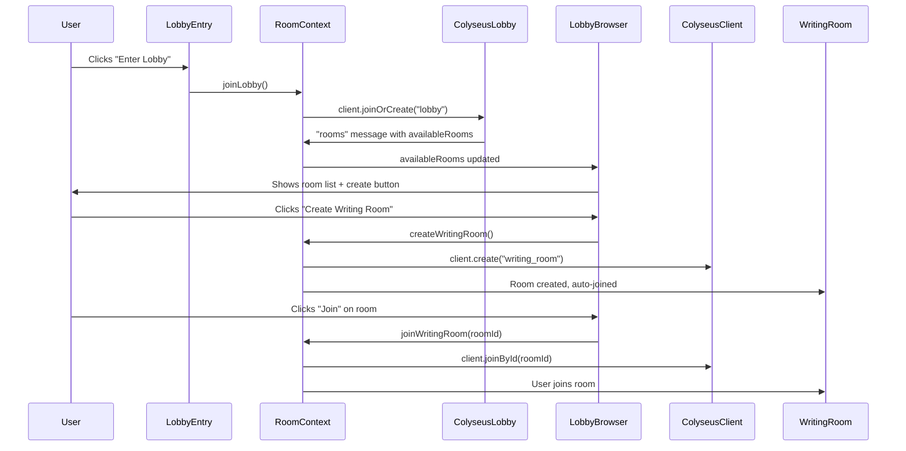
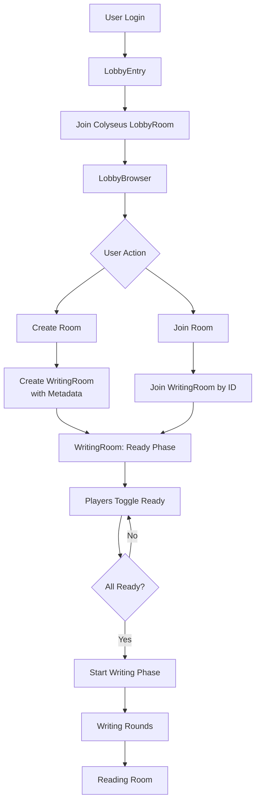

# 🗺️ COMPREHENSIVE ARCHITECTURE MAP: Colyseus Writing Game

Based on our deep analysis of your codebase, here's the exhaustive architecture documentation you requested.

## 🏗️ 1. DATA MODEL MAP

### Database Schema (Prisma Models)



### Colyseus State Schema

```typescript
// WritingGameState.ts - Real-time Synchronized State
WritingGameState {
  // Game Flow
  phase: "lobby" | "writing" | "betweenRounds" | "reading"
  timerEndsAt: number
  timeRemaining: number
  currentRound: number
  
  // Lobby Management
  readyOrder: string[]                    // Session IDs in ready order
  lobbyCountdownRemaining: number
  isLobbyCountdownActive: boolean
  
  // Player Management
  players: MapSchema<Player>              // sessionId → Player
  readyStates: MapSchema<boolean>         // sessionId → isReady
  
  // Story Management  
  stories: MapSchema<Story>               // storyId → Story
  currentAssignments: MapSchema<string>   // sessionId → storyId
}

Player {
  playerId: string        // Matches sessionId
  playerName: string
  email: string
  isAuthenticated: boolean
  isReady: boolean
  hasSubmitted: boolean
}

Story {
  storyId: string         // Matches database story.id
  originalPrompt: string
  accumulatedContent: string
  currentRound: number
  segments: MapSchema<string>  // sessionId → submitted text
}
```

### Client-Side State Structure

```typescript
// Context-Based State Management
AuthContext {
  user: { id, email, name } | null
  login(email, password): Promise<void>
  register(email, password, name): Promise<void>
  logout(): Promise<void>
  client: Colyseus.Client
}

RoomContext {
  currentRoom: Room | null
  roomType: "lobby" | "writing_room" | "reading_room" | null
  availableRooms: any[]
  joinLobby(): Promise<void>
  joinWritingRoom(roomId): Promise<void>
  createWritingRoom(options): Promise<void>
  joinReadingRoom(gameSessionId?): Promise<void>
  leaveRoom(): Promise<void>
}

GameContext {
  // Reactive State
  gameState: WritingGameState | null
  players: Player[]
  writingText: string
  isSubmitting: boolean
  
  // Actions
  setWritingText(text): void
  toggleReady(): void
  submitWriting(): void
  backToLobby(): void
  
  // Utilities
  getCurrentPlayer(): Player | null
  formatTime(ms): string
}
```

## 🔄 2. FUNCTION FLOW MAP

### Room Lifecycle



### Game Phase Transitions

```typescript
// Phase State Machine
"lobby"
  → (all players ready + countdown) → "writing"
  
"writing" 
  → (timer expires OR all submissions) → "betweenRounds"
  
"betweenRounds"
  → (buffer timer) → "writing" OR "reading"
  
"writing"
  → (all rounds complete) → "reading"

// Transition Conditions
lobby → writing: 
  - readyOrder.length >= minPlayers (2)
  - lobbyCountdownRemaining <= 0

writing → betweenRounds:
  - timeRemaining <= 0 OR all players hasSubmitted

betweenRounds → writing:
  - currentRound < totalPlayers
  - buffer timer expires

betweenRounds → reading:
  - currentRound >= totalPlayers
```

### Message Handlers and Data Flow

```mermaid
flowchart TD
    subgraph ClientMessages [Client → Server]
        C1[toggleReady] -->|no payload| S1[handlePlayerReady]
        C2[submitWriting] -->|{ content }| S2[handleWritingSubmission]
        C3[backToLobby] -->|no payload| S3[handleBackToLobby]
    end

    subgraph ServerMessages [Server → Client]
        S4[lobbyCountdownUpdate] -->|{ timeRemaining, readyPlayers }| C4[Lobby UI]
        S5[timerUpdate] -->|{ timeRemaining, phase }| C5[Phase Components]
        S6[moveToReadingRoom] -->|{ gameSessionId }| C6[RoomContext.joinReadingRoom]
        S7[gameResetToLobby] -->|no payload| C7[Reset to lobby state]
    end

    subgraph DatabaseOperations [Database Interactions]
        S1 --> DB1[Update readyStates]
        S2 --> DB2[updateStoryWithEdit]
        S2 --> DB3[Update story.accumulatedContent]
        S3 --> DB4[Reset game session]
    end
```

## 🧩 3. COMPONENT ARCHITECTURE

### Client Component Hierarchy

```
RootLayout (layout.tsx)
├── AuthProvider
├── RoomProvider  
└── GameProvider
    └── Home (page.tsx)
        ├── AppHeader
        └── Main Content Router
            ├── LobbyEntry (no room)
            │   └── Join Lobby Button
            ├── LobbyBrowser (lobby room)
            │   ├── Room List
            │   ├── Create Room Button
            │   └── Join Room Buttons
            ├── GameView (writing_room)
            │   ├── PlayerList
            │   └── Phase Router
            │       ├── ReadyPhase (lobby)
            │       │   └── Ready Toggle Button
            │       └── WritingPhase (writing)
            │           ├── Story Header
            │           ├── Accumulated Content
            │           ├── SimpleEditor (Tiptap)
            │           └── Submit Button
            └── ReadingView (reading_room)
                ├── Story List
                └── Story History Viewer
```

### Context Provider Dependencies

```typescript
// Provider Hierarchy
<AuthProvider>           // Colyseus client, user auth state
  <RoomProvider>         // Room connection management
    <GameProvider>       // Game state and actions
      {children}         // Page components
    </GameProvider>
  </RoomProvider>
</AuthProvider>

// Hook Dependencies
useRoom()    → requires useAuth()    // Needs client from AuthContext  
useGame()    → requires useRoom()    // Needs currentRoom from RoomContext
```

### Route Structure

```typescript
// Next.js App Router
/                          → Home (page.tsx) - Main router
/simple                    → Simple editor test page
/app/game/[roomId]         → [NOT CURRENTLY USED - GameClient.tsx is deprecated]
```

## 📡 4. MESSAGE PROTOCOL

### Client → Server Messages

```typescript
// WritingRoom Message Handlers
interface ClientMessages {
  // Lobby Management
  "toggleReady": {
    // No payload - uses client.sessionId
    handler: (client: Client) => void
    action: Toggles player ready state, updates readyOrder
  }
  
  "backToLobby": {
    // No payload  
    handler: () => void
    action: Resets game to lobby state, clears timers
  }
  
  // Gameplay
  "submitWriting": {
    payload: {
      content: string  // HTML content from Tiptap editor
    }
    handler: (client: Client, message: { content: string }) => void
    action: Saves story continuation, updates database
  }
}

// ReadingRoom Message Handlers  
interface ReadingRoomMessages {
  "requestStories": {
    // No payload
    handler: (client: Client) => void
    action: Sends available stories for current user
  }
  
  "requestStoryHistory": {
    payload: {
      storyId: string
    }
    handler: (client: Client, message: { storyId: string }) => void  
    action: Sends full edit history for specific story
  }
}
```

### Server → Client Broadcasts

```typescript
// WritingRoom Broadcasts
interface ServerBroadcasts {
  // Lobby Updates
  "lobbyCountdownUpdate": {
    data: {
      timeRemaining: number
      readyPlayers: number
    }
    trigger: Every second during lobby countdown
  }
  
  "lobbyCountdownCancelled": {
    data: none
    trigger: When ready players drops below minimum
  }
  
  // Game Flow
  "timerUpdate": {
    data: {
      timeRemaining: number
      phase: string
    }
    trigger: Every second during active phases
  }
  
  "gameResetToLobby": {
    data: none  
    trigger: When game is reset to lobby state
  }
  
  // Room Transition
  "moveToReadingRoom": {
    data: {
      gameSessionId: string
    }
    trigger: When all writing rounds complete
  }
}

// ReadingRoom Messages
interface ReadingRoomMessages {
  "storiesData": {
    data: {
      currentlyReading: StoryData[]
      storyShelf: StoryData[]  
    }
    trigger: On join or requestStories
  }
  
  "storyHistory": {
    data: {
      story: StoryData
      editHistory: any[]
    }
    trigger: On requestStoryHistory
  }
  
  "error": {
    data: {
      message: string
    }
    trigger: On database errors
  }
}
```

### Error Handling Flows

```mermaid
flowchart TD
    subgraph AuthenticationErrors
        A1[Invalid JWT] --> A2[Throw Error in onAuth]
        A2 --> A3[Client connection rejected]
    end

    subgraph GameFlowErrors
        B1[submitWriting in wrong phase] --> B2[Console error, no action]
        B2 --> B3[User sees unchanged UI]
        
        B4[No story assignment] --> B5[Console error, no submission]
        B5 --> B6[User cannot submit]
    end

    subgraph DatabaseErrors
        C1[Prisma operation fails] --> C2[Console error, continue]
        C2 --> C3[Game continues without persistence]
        C3 --> C4[Manual recovery needed]
    end

    subgraph NetworkErrors
        D1[Client disconnect] --> D2[onLeave cleanup]
        D2 --> D3[Remove player from state]
        D3 --> D4[Check lobby start conditions]
    end
```



## 🔍 CRITICAL FINDINGS & TECH DEBT

### Active vs Deprecated Code

**✅ ACTIVE IMPLEMENTATION:**
- `GameView.tsx` + `GameContext` + `RoomContext` pattern
- Message protocol: `toggleReady`, `submitWriting`, `backToLobby`
- Phase components: `ReadyPhase`, `WritingPhase`
- Database integration with full edit history

**❌ DEPRECATED/UNUSED:**
- `GameClient.tsx` - Uses different message names (`player_ready` vs `toggleReady`)
- `EditingPhase.tsx` - Not in current game flow
- `GameSetupPhase.tsx` - Not in current game flow  
- `/app/game/[roomId]/page.tsx` - Route not used

### Data Flow Inconsistencies

1. **Story ID Handling**: Mix of database IDs (`story.id`) and generated IDs in some components
2. **Player Identification**: Using `sessionId` as `playerId` - works but limits user persistence
3. **Message Protocol**: Some components expect different message formats

### Missing Pieces for Completion

```typescript
// Required for Full Functionality
1. ReadingView Implementation
2. AutoSave Integration  
3. Rich Text Editor (Tiptap) state synchronization
4. Error boundary components
5. Reconnection handling
```

## 🎯 RECOMMENDED REFACTORING PRIORITIES

### Phase 1: Critical Fixes
1. Remove deprecated `GameClient.tsx` and related components
2. Standardize message protocol across all components
3. Implement proper error boundaries

### Phase 2: Enhanced Functionality  
1. Complete ReadingView integration
2. Add auto-save during writing phase
3. Implement rich text collaboration features

### Phase 3: Production Ready
1. Add comprehensive error handling
2. Implement reconnection logic
3. Add loading states and UX improvements

This architecture map provides a complete picture of your current implementation and serves as a guide for future development. The core game loop is solid - focus on completing the reading room integration and cleaning up the deprecated code paths.


Addendum:

Excellent question! Looking back, here are the crucial additions I'd make for a new developer:

## 🆕 ONBOARDING GUIDE & PROJECT CONTEXT

### 🚀 Quick Start Guide

```markdown
# 5-Minute Setup
1. `git clone` and checkout `nextjs-migration` branch
2. `cd server && npm install && npx prisma generate && npm run dev`
3. `cd ../nextjs-client && npm install && npm run dev`  
4. Open http://localhost:3000
5. Register account → Create writing room → Test game flow
```

### 🎯 "First 2 Hours" Exploration Path

```markdown
## Where to Look First:
1. **Start Here**: `nextjs-client/src/app/page.tsx` - Main app router
2. **Follow Flow**: `RoomContext.tsx` → `GameContext.tsx` → `WritingRoom.ts`
3. **Understand Data**: `WritingGameState.ts` (schema) + Prisma schema
4. **Test Game**: Create room → Toggle ready → Submit writing → See rotation

## Key Files to Read (in order):
1. `page.tsx` (client) - App structure
2. `WritingRoom.ts` (server) - Core game logic  
3. `GameContext.tsx` (client) - State management
4. `WritingGameState.ts` (shared) - Data structure
```

### 🔍 "Why This Architecture?" Context

**Key Design Decisions:**
```typescript
// 1. Why separate WritingRoom and ReadingRoom?
//    - Separation of concerns: real-time gameplay vs. persistent data viewing
//    - Different scaling needs: writing needs strict player limits, reading doesn't

// 2. Why Context providers instead of Redux?
//    - Colyseus rooms are naturally stateful - contexts mirror this
//    - Game state is hierarchical: Auth → Room → Game

// 3. Why database + Colyseus state?
//    - Colyseus state: real-time synchronization (phase, timer, ready states)
//    - Database: persistence (stories, edit history, user accounts)
```

### 🐛 Common "Gotchas" & Debugging Tips

```typescript
// 1. Message Protocol Mismatch
// ❌ Deprecated: room.send("player_ready")
// ✅ Use: room.send("toggleReady")

// 2. State Access Pattern
// ❌ gameState.players.$items 
// ✅ Array.from(gameState.players.values())

// 3. Database vs Memory State
console.log("DEBUG PATHS:");
console.log(" - Memory:", gameState.stories.get(storyId)?.accumulatedContent);
console.log(" - Database:", await prisma.story.findUnique({ where: { id: storyId } }));

// 4. Phase Transition Debugging
const phaseDebug = {
  currentPhase: gameState.phase,
  readyPlayers: gameState.readyOrder.length, 
  totalPlayers: gameState.players.size,
  timeRemaining: gameState.timeRemaining,
  currentRound: gameState.currentRound
};
```

### 📋 Development Workflow Guide

```markdown
## Adding a New Feature (Example: Voting System)

1. **Database First**: Extend Prisma schema
2. **State Schema**: Add to WritingGameState.ts  
3. **Server Logic**: Implement in WritingRoom.ts
4. **Client Context**: Add to GameContext.tsx
5. **UI Component**: Create VotingPhase.tsx
6. **Integration**: Add to GameView phase router

## Testing Checklist:
- [ ] Message handlers work both ways
- [ ] State synchronizes across clients
- [ ] Database persists correctly
- [ ] Error handling for edge cases
- [ ] Phase transitions work smoothly
```

### 🎮 Game Flow Visualization



### 🔧 Configuration Quick Reference

```typescript
// Key Configuration Files:
const configFiles = {
  gameTiming: 'server/src/constants/game-config.ts',
  database: 'server/prisma/schema.prisma', 
  serverSetup: 'server/src/app.config.ts',
  clientContext: 'nextjs-client/src/contexts/',
  phaseComponents: 'nextjs-client/src/components/game/phases/'
};

// Important Constants:
const CRITICAL_VALUES = {
  MIN_PLAYERS: 2,           // game-config.ts
  MAX_PLAYERS: 8,           // game-config.ts  
  WRITING_TIME: 30000,      // 30 seconds
  LOBBY_COUNTDOWN: 5000,    // 5 seconds
  ROUND_BUFFER: 5000        // 5 seconds between rounds
};
```

### 📞 "Who Ya Gonna Call?" Troubleshooting

```markdown
## When X happens, check Y:

**Players can't submit writing:**
- Check: `WritingRoom.ts` handleWritingSubmission() phase validation
- Check: `GameContext.tsx` submitWriting() message format

**Game doesn't start:**
- Check: `WritingRoom.ts` checkLobbyStart() minPlayers logic
- Check: `ReadyPhase.tsx` toggleReady() message sending

**Stories not rotating:**
- Check: `WritingRoom.ts` rotateStoryAssignments() algorithm
- Check: `WritingGameState.ts` currentAssignments map

**Database not updating:**
- Check: `WritingRoom.ts` updateStoryWithEdit() Prisma call
- Check: Server console for Prisma errors
```

### 🎯 Learning Path for Colyseus Beginners

```markdown
## If New to Colyseus:
1. **Understand Schema**: How data syncs in real-time
2. **Room Lifecycle**: onCreate, onJoin, onMessage, onDispose  
3. **State Management**: Difference between room state and database state
4. **Message Flow**: Client → Server → Broadcast patterns

## Key Colyseus Concepts in This Project:
- **Room**: WritingRoom, ReadingRoom (separate concerns)
- **State**: WritingGameState (synchronized automatically)
- **Schema**: Player, Story (define syncable data structures)
- **Auth**: JWT integration with @colyseus/auth
```

This additional context would dramatically reduce the onboarding time and help new developers understand not just *what* the code does, but *why* it's structured that way and *how* to work with it effectively.

Perfect! Now I can see exactly how your lobby works. Let me map the current flow and then show you the optimized Colyseus LobbyRoom approach.

## 🗺️ CURRENT LOBBY FLOW MAP

### Current Data Flow Analysis



### Current File Responsibilities

```typescript
// LobbyEntry.tsx
// - Simple entry point to lobby
// - Calls RoomContext.joinLobby()

// LobbyBrowser.tsx  
// - Shows availableRooms from RoomContext
// - Create room: RoomContext.createWritingRoom()
// - Join room: RoomContext.joinWritingRoom(roomId)

// RoomContext.tsx
// - Manages Colyseus LobbyRoom connection
// - Receives "rooms" messages for discovery
// - Handles room creation/joining

// WritingRoom.ts
// - Handles "ready" phase (currently called "lobby")
// - Manages player readiness within game room
```

## 🚀 OPTIMIZED COLYSEUS LOBBYROOM INTEGRATION

### Ideal Architecture Using Colyseus LobbyRoom

```typescript
// RoomContext.tsx - OPTIMIZED VERSION
const joinLobby = async () => {
  if (!client || !user) return;
  try {
    setIsJoining(true);
    
    // Join Colyseus LobbyRoom with metadata
    const lobby = await client.joinOrCreate("lobby", {
      user: {
        id: user.id,
        name: user.name,
        email: user.email
      }
    });
    
    // Enhanced room listing with metadata
    lobby.onMessage("rooms", (rooms) => {
      const enhancedRooms = rooms.map(room => ({
        ...room,
        // Add computed properties
        canJoin: room.clients < room.maxClients,
        isFull: room.clients >= room.maxClients,
        playerCount: room.clients,
        hasPassword: !!room.metadata?.passwordProtected
      }));
      setAvailableRooms(enhancedRooms);
    });
    
    // Handle room updates in real-time
    lobby.onMessage("update", (update) => {
      // Real-time updates when rooms are created/closed
      console.log("Lobby update:", update);
    });
    
    setCurrentRoom(lobby);
  } catch (error) {
    console.error("Failed to join lobby:", error);
  }
};

// Enhanced room creation with metadata
const createWritingRoom = async (options: RoomCreationOptions = {}) => {
  const defaultOptions = {
    name: `${user.name}'s Writing Room`,
    host: user.name,
    hostId: user.id,
    createdAt: new Date().toISOString(),
    passwordProtected: false,
    ...options
  };

  const gameRoom = await client.create("writing_room", defaultOptions);
  // Room automatically appears in lobby due to enableRealtimeListing()
};
```

### Updated Game Phase Naming

```typescript
// WritingGameState.ts - RENAME "lobby" phase to "ready"
export class WritingGameState extends Schema {
  @type("string") phase: string = "ready"; // WAS: "lobby"
  // ... rest unchanged
}

// WritingRoom.ts - Update all phase references
private initializeGame() {
  this.state.phase = "ready"; // WAS: "lobby"
  // ...
}

private handlePlayerReady(client: Client) {
  // This now manages "ready" phase, not "lobby"
  this.checkReadyStart(); // WAS: checkLobbyStart()
}
```

### Enhanced LobbyBrowser with Colyseus Features

```typescript
// LobbyBrowser.tsx - ENHANCED VERSION
export function LobbyBrowser() {
  const { availableRooms, joinWritingRoom, createWritingRoom } = useRoom();

  // Group rooms by status
  const available = availableRooms.filter(room => room.canJoin);
  const full = availableRooms.filter(room => room.isFull);
  const passwordProtected = availableRooms.filter(room => room.hasPassword);

  return (
    <div className="max-w-6xl mx-auto space-y-8">
      {/* Room Creation with Options */}
      <RoomCreationPanel onCreateRoom={createWritingRoom} />
      
      {/* Available Rooms */}
      <RoomSection 
        title="Available Rooms" 
        rooms={available}
        onJoinRoom={joinWritingRoom}
      />
      
      {/* Full Rooms (for visibility) */}
      <RoomSection
        title="Full Rooms"
        rooms={full} 
        disabled={true}
      />
      
      {/* Real-time Stats */}
      <LobbyStats rooms={availableRooms} />
    </div>
  );
}
```

## 🎯 COMPREHENSIVE LOBBY FLOW MAP

### Complete User Journey



### File-by-File Lobby Responsibilities

```typescript
// SERVER SIDE
app.config.ts:
  - Defines "lobby" room (Colyseus LobbyRoom)
  - Defines "writing_room" with enableRealtimeListing()

WritingRoom.ts:
  - MANAGES: "ready" phase (player readiness)
  - NO LONGER: Room discovery (delegated to LobbyRoom)
  - HANDLES: Game start when all players ready

// CLIENT SIDE  
RoomContext.tsx:
  - MANAGES: LobbyRoom connection
  - RECEIVES: Room listings via "rooms" messages
  - PROVIDES: join/create room methods

LobbyEntry.tsx:
  - SIMPLE: Entry point to lobby system
  - TRIGGERS: RoomContext.joinLobby()

LobbyBrowser.tsx:
  - DISPLAYS: availableRooms from RoomContext
  - PROVIDES: Room creation and joining UI
  - SHOWS: Real-time room status

GameContext.tsx:
  - MANAGES: "ready" phase interactions
  - HANDLES: toggleReady() within game room
```

### Colyseus LobbyRoom Benefits You Get for Free

```typescript
// Automatic Features You're Already Getting:
const benefits = {
  realTimeListings: true,     // Rooms appear/disappear in real-time
  roomMetadata: true,         // Custom room data (name, host, etc.)
  clientCountTracking: true,  // Automatic player counts
  roomFiltering: true,        // Can filter by room properties
  autoCleanup: true,          // Closed rooms removed automatically
};

// Room Metadata Structure (automatic):
interface RoomMetadata {
  name: string;
  host: string; 
  hostId: string;
  createdAt: string;
  maxClients: number;
  // Your custom fields:
  passwordProtected?: boolean;
  language?: string;
  storyTheme?: string;
}
```

## 🔧 MIGRATION STEPS

### Phase 1: Rename Game Phase (Quick Win)
```bash
# 1. Update WritingGameState.ts phase from "lobby" → "ready"
# 2. Update WritingRoom.ts phase references
# 3. Update client components to use "ready" phase
```

### Phase 2: Enhance LobbyRoom Integration
```bash
# 1. Add rich metadata to room creation
# 2. Enhance LobbyBrowser with room grouping
# 3. Add real-time lobby statistics
```

### Phase 3: Advanced Features
```bash
# 1. Room passwords/private games
# 2. Room filtering/search
# 3. Lobby chat system
# 4. User profiles in lobby
```

This optimized approach gives you the best of both worlds: Colyseus handles room discovery automatically, while your game handles the actual gameplay states cleanly separated as "ready" → "writing" → "reading".