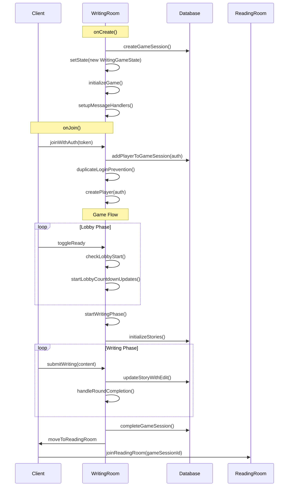

# 🗺️ COMPREHENSIVE ARCHITECTURE MAP: Colyseus Writing Game

Based on our deep analysis of your codebase, here's the exhaustive architecture documentation you requested.

## 🏗️ 1. DATA MODEL MAP

### Database Schema (Prisma Models)

```mermaid
erDiagram
    User ||--o{ GameParticipant : "participates in"
    User ||--o{ Prompt : "creates"
    User ||--o{ AutoSave : "has"
    GameSession ||--o{ GameParticipant : "has"
    GameSession ||--o{ Story : "contains"
    Prompt ||--o{ Story : "used by"
    Story ||--|{ StoryEdit : "accumulates"

    User {
        string id @id
        string email @unique
        string password
        string? name
        DateTime createdAt
        DateTime updatedAt
    }

    GameSession {
        string id @id
        string roomId @unique
        string status
        DateTime createdAt
        DateTime? completedAt
    }

    GameParticipant {
        string id @id
        string gameSessionId
        string playerId
        DateTime joinedAt
        @@unique([gameSessionId, playerId])
    }

    Story {
        string id @id
        string gameSessionId
        string promptId
        int orderIndex
        string accumulatedContent
        Json editHistory
        DateTime createdAt
        DateTime updatedAt
    }

    Prompt {
        string id @id
        string text
        int usedCount
        DateTime createdAt
        string? creatorId
    }

    AutoSave {
        string id @id
        string roomId
        string playerId
        string content
        DateTime createdAt
        DateTime updatedAt
        @@unique([roomId, playerId])
    }
```

### Colyseus State Schema

```typescript
// WritingGameState.ts - Real-time Synchronized State
WritingGameState {
  // Game Flow
  phase: "lobby" | "writing" | "betweenRounds" | "reading"
  timerEndsAt: number
  timeRemaining: number
  currentRound: number
  
  // Lobby Management
  readyOrder: string[]                    // Session IDs in ready order
  lobbyCountdownRemaining: number
  isLobbyCountdownActive: boolean
  
  // Player Management
  players: MapSchema<Player>              // sessionId → Player
  readyStates: MapSchema<boolean>         // sessionId → isReady
  
  // Story Management  
  stories: MapSchema<Story>               // storyId → Story
  currentAssignments: MapSchema<string>   // sessionId → storyId
}

Player {
  playerId: string        // Matches sessionId
  playerName: string
  email: string
  isAuthenticated: boolean
  isReady: boolean
  hasSubmitted: boolean
}

Story {
  storyId: string         // Matches database story.id
  originalPrompt: string
  accumulatedContent: string
  currentRound: number
  segments: MapSchema<string>  // sessionId → submitted text
}
```

### Client-Side State Structure

```typescript
// Context-Based State Management
AuthContext {
  user: { id, email, name } | null
  login(email, password): Promise<void>
  register(email, password, name): Promise<void>
  logout(): Promise<void>
  client: Colyseus.Client
}

RoomContext {
  currentRoom: Room | null
  roomType: "lobby" | "writing_room" | "reading_room" | null
  availableRooms: any[]
  joinLobby(): Promise<void>
  joinWritingRoom(roomId): Promise<void>
  createWritingRoom(options): Promise<void>
  joinReadingRoom(gameSessionId?): Promise<void>
  leaveRoom(): Promise<void>
}

GameContext {
  // Reactive State
  gameState: WritingGameState | null
  players: Player[]
  writingText: string
  isSubmitting: boolean
  
  // Actions
  setWritingText(text): void
  toggleReady(): void
  submitWriting(): void
  backToLobby(): void
  
  // Utilities
  getCurrentPlayer(): Player | null
  formatTime(ms): string
}
```

## 🔄 2. FUNCTION FLOW MAP

### Room Lifecycle



### Game Phase Transitions

```typescript
// Phase State Machine
"lobby"
  → (all players ready + countdown) → "writing"
  
"writing" 
  → (timer expires OR all submissions) → "betweenRounds"
  
"betweenRounds"
  → (buffer timer) → "writing" OR "reading"
  
"writing"
  → (all rounds complete) → "reading"

// Transition Conditions
lobby → writing: 
  - readyOrder.length >= minPlayers (2)
  - lobbyCountdownRemaining <= 0

writing → betweenRounds:
  - timeRemaining <= 0 OR all players hasSubmitted

betweenRounds → writing:
  - currentRound < totalPlayers
  - buffer timer expires

betweenRounds → reading:
  - currentRound >= totalPlayers
```

### Message Handlers and Data Flow

```mermaid
flowchart TD
    subgraph ClientMessages [Client → Server]
        C1[toggleReady] -->|no payload| S1[handlePlayerReady]
        C2[submitWriting] -->|{ content }| S2[handleWritingSubmission]
        C3[backToLobby] -->|no payload| S3[handleBackToLobby]
    end

    subgraph ServerMessages [Server → Client]
        S4[lobbyCountdownUpdate] -->|{ timeRemaining, readyPlayers }| C4[Lobby UI]
        S5[timerUpdate] -->|{ timeRemaining, phase }| C5[Phase Components]
        S6[moveToReadingRoom] -->|{ gameSessionId }| C6[RoomContext.joinReadingRoom]
        S7[gameResetToLobby] -->|no payload| C7[Reset to lobby state]
    end

    subgraph DatabaseOperations [Database Interactions]
        S1 --> DB1[Update readyStates]
        S2 --> DB2[updateStoryWithEdit]
        S2 --> DB3[Update story.accumulatedContent]
        S3 --> DB4[Reset game session]
    end
```

## 🧩 3. COMPONENT ARCHITECTURE

### Client Component Hierarchy

```
RootLayout (layout.tsx)
├── AuthProvider
├── RoomProvider  
└── GameProvider
    └── Home (page.tsx)
        ├── AppHeader
        └── Main Content Router
            ├── LobbyEntry (no room)
            │   └── Join Lobby Button
            ├── LobbyBrowser (lobby room)
            │   ├── Room List
            │   ├── Create Room Button
            │   └── Join Room Buttons
            ├── GameView (writing_room)
            │   ├── PlayerList
            │   └── Phase Router
            │       ├── ReadyPhase (lobby)
            │       │   └── Ready Toggle Button
            │       └── WritingPhase (writing)
            │           ├── Story Header
            │           ├── Accumulated Content
            │           ├── SimpleEditor (Tiptap)
            │           └── Submit Button
            └── ReadingView (reading_room)
                ├── Story List
                └── Story History Viewer
```

### Context Provider Dependencies

```typescript
// Provider Hierarchy
<AuthProvider>           // Colyseus client, user auth state
  <RoomProvider>         // Room connection management
    <GameProvider>       // Game state and actions
      {children}         // Page components
    </GameProvider>
  </RoomProvider>
</AuthProvider>

// Hook Dependencies
useRoom()    → requires useAuth()    // Needs client from AuthContext  
useGame()    → requires useRoom()    // Needs currentRoom from RoomContext
```

### Route Structure

```typescript
// Next.js App Router
/                          → Home (page.tsx) - Main router
/simple                    → Simple editor test page
/app/game/[roomId]         → [NOT CURRENTLY USED - GameClient.tsx is deprecated]
```

## 📡 4. MESSAGE PROTOCOL

### Client → Server Messages

```typescript
// WritingRoom Message Handlers
interface ClientMessages {
  // Lobby Management
  "toggleReady": {
    // No payload - uses client.sessionId
    handler: (client: Client) => void
    action: Toggles player ready state, updates readyOrder
  }
  
  "backToLobby": {
    // No payload  
    handler: () => void
    action: Resets game to lobby state, clears timers
  }
  
  // Gameplay
  "submitWriting": {
    payload: {
      content: string  // HTML content from Tiptap editor
    }
    handler: (client: Client, message: { content: string }) => void
    action: Saves story continuation, updates database
  }
}

// ReadingRoom Message Handlers  
interface ReadingRoomMessages {
  "requestStories": {
    // No payload
    handler: (client: Client) => void
    action: Sends available stories for current user
  }
  
  "requestStoryHistory": {
    payload: {
      storyId: string
    }
    handler: (client: Client, message: { storyId: string }) => void  
    action: Sends full edit history for specific story
  }
}
```

### Server → Client Broadcasts

```typescript
// WritingRoom Broadcasts
interface ServerBroadcasts {
  // Lobby Updates
  "lobbyCountdownUpdate": {
    data: {
      timeRemaining: number
      readyPlayers: number
    }
    trigger: Every second during lobby countdown
  }
  
  "lobbyCountdownCancelled": {
    data: none
    trigger: When ready players drops below minimum
  }
  
  // Game Flow
  "timerUpdate": {
    data: {
      timeRemaining: number
      phase: string
    }
    trigger: Every second during active phases
  }
  
  "gameResetToLobby": {
    data: none  
    trigger: When game is reset to lobby state
  }
  
  // Room Transition
  "moveToReadingRoom": {
    data: {
      gameSessionId: string
    }
    trigger: When all writing rounds complete
  }
}

// ReadingRoom Messages
interface ReadingRoomMessages {
  "storiesData": {
    data: {
      currentlyReading: StoryData[]
      storyShelf: StoryData[]  
    }
    trigger: On join or requestStories
  }
  
  "storyHistory": {
    data: {
      story: StoryData
      editHistory: any[]
    }
    trigger: On requestStoryHistory
  }
  
  "error": {
    data: {
      message: string
    }
    trigger: On database errors
  }
}
```

### Error Handling Flows

```mermaid
flowchart TD
    subgraph AuthenticationErrors
        A1[Invalid JWT] --> A2[Throw Error in onAuth]
        A2 --> A3[Client connection rejected]
    end

    subgraph GameFlowErrors
        B1[submitWriting in wrong phase] --> B2[Console error, no action]
        B2 --> B3[User sees unchanged UI]
        
        B4[No story assignment] --> B5[Console error, no submission]
        B5 --> B6[User cannot submit]
    end

    subgraph DatabaseErrors
        C1[Prisma operation fails] --> C2[Console error, continue]
        C2 --> C3[Game continues without persistence]
        C3 --> C4[Manual recovery needed]
    end

    subgraph NetworkErrors
        D1[Client disconnect] --> D2[onLeave cleanup]
        D2 --> D3[Remove player from state]
        D3 --> D4[Check lobby start conditions]
    end
```



## 🔍 CRITICAL FINDINGS & TECH DEBT

### Active vs Deprecated Code

**✅ ACTIVE IMPLEMENTATION:**
- `GameView.tsx` + `GameContext` + `RoomContext` pattern
- Message protocol: `toggleReady`, `submitWriting`, `backToLobby`
- Phase components: `ReadyPhase`, `WritingPhase`
- Database integration with full edit history

**❌ DEPRECATED/UNUSED:**
- `GameClient.tsx` - Uses different message names (`player_ready` vs `toggleReady`)
- `EditingPhase.tsx` - Not in current game flow
- `GameSetupPhase.tsx` - Not in current game flow  
- `/app/game/[roomId]/page.tsx` - Route not used

### Data Flow Inconsistencies

1. **Story ID Handling**: Mix of database IDs (`story.id`) and generated IDs in some components
2. **Player Identification**: Using `sessionId` as `playerId` - works but limits user persistence
3. **Message Protocol**: Some components expect different message formats

### Missing Pieces for Completion

```typescript
// Required for Full Functionality
1. ReadingView Implementation
2. AutoSave Integration  
3. Rich Text Editor (Tiptap) state synchronization
4. Error boundary components
5. Reconnection handling
```

## 🎯 RECOMMENDED REFACTORING PRIORITIES

### Phase 1: Critical Fixes
1. Remove deprecated `GameClient.tsx` and related components
2. Standardize message protocol across all components
3. Implement proper error boundaries

### Phase 2: Enhanced Functionality  
1. Complete ReadingView integration
2. Add auto-save during writing phase
3. Implement rich text collaboration features

### Phase 3: Production Ready
1. Add comprehensive error handling
2. Implement reconnection logic
3. Add loading states and UX improvements

This architecture map provides a complete picture of your current implementation and serves as a guide for future development. The core game loop is solid - focus on completing the reading room integration and cleaning up the deprecated code paths.